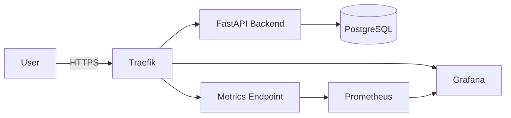

# ERP DevOps Portfolio


---

Production-like infrastructure for a web-based ERP system running on a single Ubuntu VPS.

## What This Project Demonstrates

This project focuses on infrastructure maturity rather than application complexity.

DevOps capabilities:

- Subdomain-based routing via reverse proxy
- Automated TLS issuance and renewal
- Public vs internal network separation
- Metrics exposure and scraping
- Infrastructure as Code (Docker Compose)
- Secure server baseline
- Deployment automation
- Architecture documentation

---

## Repository Structure

```
erp-devops-portfolio/
│
├── app/
│ └── backend/ # FastAPI application
│
├── infra/
│ └── compose/
│ └── prod/ # Production Docker Compose definition
│
├── scripts/
│ └── deploy.sh # Idempotent deployment script (VPS)
│
├── docs/
│ ├── architecture.md # System architecture (C4 / Mermaid)
│ ├── runbooks/ # Operational procedures
│ └── adr/ # Architecture Decision Records
│
├── .github/workflows/ # CI pipeline definitions
├── .yamllint # YAML lint configuration
└── README.md
```

---

## Current Milestone

v0.5 – CI pipeline validation + security scanning

CI (GitHub Actions):
- Validate Docker Compose configuration
- Build backend image
- YAML lint (yamllint)
- Shell lint (ShellCheck)
- Vulnerability scanning (Trivy) – optional/iterative

> CI performs validation and security checks only.  
> Continuous Deployment is intentionally not enabled; deployment remains SSH-based by design.

Documentation:
- [docs/runbooks/ci.md](docs/runbooks/ci.md) 
- [ADR 0005-ci-pipeline.md](docs/adr/0005-ci-pipeline.md)

---

## Live Endpoints

- ERP API: https://erp.adiwoj.pl
- Observability (Grafana): https://grafana.adiwoj.pl

---

## Architecture Overview


---

## Tech Stack

|Layer |	Tool|
|------|------|
|OS	| Ubuntu 24|
|Container Runtime	| Docker CE|
|Reverse Proxy	| Traefik v3|
|TLS	| Let's Encrypt|
|Metrics	| Prometheus|
|Visualization	| Grafana|
|Firewall	| UFW|
|Intrusion Protection	| Fail2ban|

---

## Network Model

Public:
- 22 (SSH)
- 80 (HTTP)
- 443 (HTTPS)

Internal:
- 8000 (backend)
- 5432 (Postgres)
- 9090 (Prometheus)
- 8082 (Traefik metrics)

Only Traefik binds public ports.

TLS termination occurs at the edge.

---

## Operational Characteristics

- Idempotent deployment [deploy.md](docs/runbooks/deploy.md)
- Health-based validation before marking deploy successful
- HTTP → HTTPS enforced
- Metrics isolated from public network
- Runtime secrets excluded from repository
- ACME storage not committed


## Deployment

On VPS:

```bash
cd /srv/erp/repo
bash ./scripts/deploy.sh
```

### What The Script Does

1. Pulls latest changes (fast-forward only)
2. Validates compose configuration
3. Builds and recreates containers
4. Shows stack status (docker compose ps)
5. Executes smoke tests:
- GET /health
- GET /readiness

---

## Documentation

Architecture: 
- [docs/architecture.md](docs/architecture.md)

Runbooks:
- [docs/runbooks/deploy.md](docs/runbooks/deploy.md)
- [docs/runbooks/ssl.md](docs/runbooks/ssl.md)
- [docs/runbooks/observability.md](docs/runbooks/observability.md)
- [docs/runbooks/ci.md](docs/runbooks/ci.md)

Architecture Decisions:
- [ADR 0001-traefik.md](docs/adr/0001-traefik.md)
- [ADR 0002-letsencrypt.md](docs/adr/0002-letsencrypt.md)
- [ADR 0003-observability.md](docs/adr/0003-observability.md)
- [ADR 0004-deployment-model.md](docs/adr/0004-deployment-model.md)
- [ADR 0005-ci-pipeline.md](docs/adr/0005-ci-pipeline.md)

---

## Security Baseline

- Root login disabled
- Password authentication disabled
- SSH key-based access only
- UFW restricting public exposure
- Fail2ban enabled
- ACME key material excluded from repository
- Prometheus not publicly exposed

---

## Versioning Strategy

Milestones:

- v0.1 – VPS hardening + Docker baseline
- v0.2 – Traefik + Automated TLS
- v0.3 – Observability stack
- v0.4 – Application layer (backend + database + health checks)
- v0.5 – CI validation and security scanning
- v1.0 – Production-ready ERP infrastructure

---

## Roadmap

- [x] FastAPI ERP backend
- [x] PostgreSQL (persistent volume)
- [x] Health & readiness endpoints
- [x] CI pipeline validation
- [ ] Database migrations (Alembic)
- [ ] Container image scanning (Trivy) as a gate
- [ ] Loki (centralized logs)
- [ ] Alertmanager
- [ ] Infrastructure provisioning via Ansible

---

## Author

This project is part of my DevOps portfolio.

Focus areas:
- Infrastructure design
- Observability engineering
- Reverse proxy and TLS automation
- Observability integration
- Documentation-driven architecture

---

## Why This Project Exists

This repository documents the incremental evolution of a production-ready stack starting from a clean VPS and building toward a secure, observable, and automated infrastructure platform.

---

