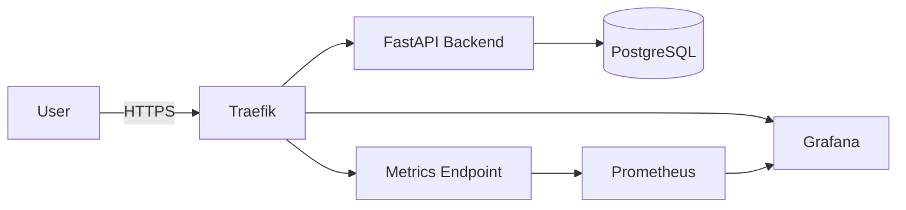

# ERP DevOps Portfolio

Production-like infrastructure for a web-based ERP system running on a single Ubuntu VPS.

This project demonstrates infrastructure design, reverse proxy architecture, automated TLS, observability integration, and documentation-driven DevOps practices.

---

## Current Milestone

v0.4 – Reverse Proxy + TLS + Observability + Application Layer

Implemented:

- VPS hardening (SSH, UFW, Fail2ban)
- Docker-based service isolation
- Traefik reverse proxy (v3)
- Automated HTTPS via Let's Encrypt (ACME HTTP-01)
- Prometheus metrics collection
- Grafana dashboards
- FastAPI backend
- PostgreSQL database
- One-command deployment script
- C4 documentation + ADR + runbooks

---

## Live Endpoints

- ERP API: https://erp.adiwoj.pl
- Observability (Grafana): https://grafana.adiwoj.pl

---

## What This Project Demonstrates

This project focuses on infrastructure maturity rather than application complexity.

DevOps capabilities:

- Subdomain-based routing via reverse proxy
- Automated TLS issuance and renewal
- Public vs internal network separation
- Metrics exposure and scraping
- Infrastructure as Code (Docker Compose)
- Secure server baseline
- Deployment automation
- Architecture documentation

---

## Architecture Overview



## Network Model

- Public ports: 22 (SSH), 80 (HTTP), 443 (HTTPS)ns
- Only Traefik binds to 80/443
- Prometheus and metrics entrypoints are internal-only
- TLS termination at edge (Traefik)

---

## Tech Stack

|Layer |	Tool|
|------|------|
|OS	| Ubuntu 24|
|Container Runtime	| Docker CE|
|Reverse Proxy	| Traefik v3|
|TLS	| Let's Encrypt|
|Metrics	| Prometheus|
|Visualization	| Grafana|
|Firewall	| UFW|
|Intrusion Protection	| Fail2ban|

---

## Deployment Model

Current model:
- Single VPS
- SSH-based deployment
- Docker Compose

Planned evolution:
- GitHub Actions CI validation
- Image scanning (Trivy)
- Infrastructure provisioning via Ansible
- Log aggregation (Loki)
- Alerts (Alertmanager)
- Application layer (FastAPI + PostgreSQL)

---

## Documentation

Architecture: 
- [docs/architecture.md](docs/architecture.md)

Runbooks:
- [docs/runbooks/deploy.md](docs/runbooks/deploy.md)
- [docs/runbooks/ssl.md](docs/runbooks/ssl.md)
- [docs/runbooks/observability.md](docs/runbooks/observability.md)

Architecture Decisions:
- [docs/adr/0001-traefik.md](docs/adr/0001-traefik.md)
- [docs/adr/0002-letsencrypt.md](docs/adr/0002-letsencrypt.md)
- [docs/adr/0003-observability.md](docs/adr/0003-observability.md)

---

## Security Baseline

- Root SSH login disabled
- Password authentication disabled
- Key-based SSH only
- UFW restricting public exposure
- Fail2ban enabled
- ACME key material excluded from repository
- Metrics endpoints not publicly exposed

---

## Versioning Strategy

Milestones:
- v0.1 – VPS hardening + Docker baseline
- v0.2 – Traefik + Automated TLSd
- v0.3 – Observability stack
- v0.4 – Application layer (planned)
- v1.0 – Production-ready ERP stack

---

## Deployment

```bash
cd /srv/erp/repo
bash ./scripts/deploy.sh
```

---

## Roadmap

- [ ] FastAPI ERP backend
- [ ] PostgreSQL with migrations
- [ ] Healthchecks & readiness probes
- [ ] CI pipeline validation
- [ ] Container image scanning
- [ ] Loki (centralized logs)
- [ ] Alertmanager
- [ ] Infrastructure provisioning via Ansible

---

## Author

This project is part of my DevOps portfolio.

Focus areas:
- Infrastructure design
- Observability engineering
- Reverse proxy and TLS automation
- Observability integration
- Documentation-driven architecture

---

## Why This Project Exists

This repository documents the incremental evolution of a production-ready stack starting from a clean VPS and building toward a secure, observable, and automated infrastructure platform.