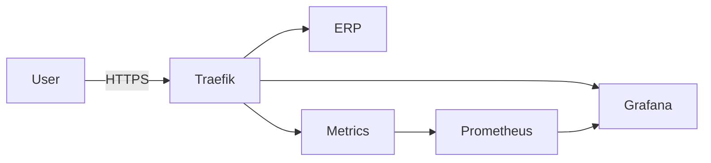

# ERP DevOps Portfolio

Production-like infrastructure for a web-based ERP system running on a single Ubuntu VPS.

This project demonstrates modern DevOps practices using:
- Docker Compose
- Traefik (reverse proxy + TLS)
- Let's Encrypt (ACME automation)
- Prometheus (metrics)
- Grafana (visualization)
- Infrastructure documentation (ADR + runbooks)

---

## Live Endpoints

- ERP (test service): https://erp.adiwoj.pl
- Observability: https://grafana.adiwoj.pl

---

## What This Project Demonstrates

- Reverse proxy routing by subdomain
- Automated TLS with ACME (no manual cert handling)
- Docker-based service isolation
- Internal vs public networking separation
- Firewall + SSH hardening
- Observability stack integration
- Infrastructure documentation (C4, ADRs, runbooks)
- Incremental, versioned evolution

---

## Architecture Overview

---

## Tech Stack

|Layer |	Tool|
|------|------|
|OS	| Ubuntu 24|
|Container Runtime	| Docker CE|
|Reverse Proxy	| Traefik v3|
|TLS	| Let's Encrypt|
|Metrics	| Prometheus|
|Visualization	| Grafana|
|Firewall	| UFW|
|Intrusion Protection	| Fail2ban|

---

## Deployment Model

Single VPS, manual SSH-based deployment (for now).

Future roadmap:
- CI/CD via GitHub Actions
- Ansible provisioning
- Blue/Green or Rolling Deployments
- Log aggregation (Loki)
- Alerts (Alertmanager)

---

## Documentation

Architecture: [docs/architecture.md](docs/architecture.md)

Runbooks:

[docs/runbooks/deploy.md](docs/runbooks/deploy.md)

[docs/runbooks/ssl.md](docs/runbooks/ssl.md)

[docs/runbooks/observability.md](docs/runbooks/observability.md)

Architecture Decisions:

[docs/adr/0001-traefik.md](docs/adr/0001-traefik.md)

[docs/adr/0002-letsencrypt.md](docs/adr/0002-letsencrypt.md)

---

## Security Notes

- Root SSH disabled
- Password login disabled
- Only ports 22/80/443 exposed
- ACME key material not committed to repository
- Internal metrics not publicly exposed

---

## Roadmap

- [ ] FastAPI ERP backend
- [ ] PostgreSQL with migrations
- [ ] CI pipeline validation
- [ ] Image security scanning (Trivy)
- [ ] Centralized logs (Loki)
- [ ] Infrastructure provisioning via Ansible

---

## Author

This project is part of my DevOps portfolio.

Focus areas:
- Infrastructure design
- Container orchestration (Compose baseline)
- Reverse proxy and TLS automation
- Observability integration
- Documentation-driven architecture

---

## 📌 Why This Project Exists

This repository demonstrates the incremental evolution of a production-ready stack, starting from a clean VPS to a secured, observable environment ready for application deployment.