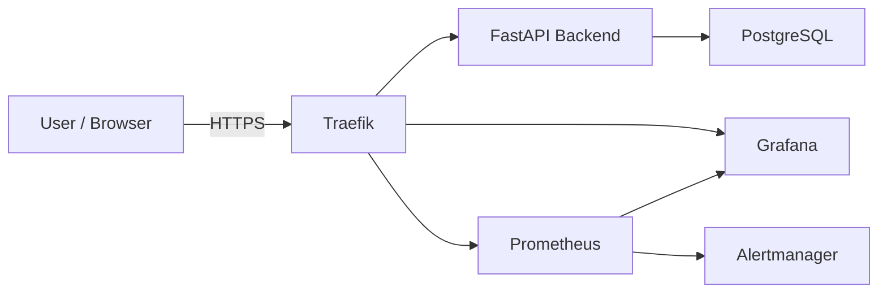

# Architecture

## Objectives

- Provide a production-like baseline on a single Ubuntu VPS
- Implement secure reverse proxy routing
- Automate TLS management
- Integrate observability from day one
- Prepare foundation for ERP backend evolution

---

## System context (C4 - Level 1)

---

## Containers (C4 - Level 2)

### Public entrypoints

Traefik:
- terminates TLS
- routes requests by Host() rules.
- Handles ACME challenges
- Exposes Prometheus metrics

Public ports:
- 80 (HTTP)
- 443 (HTTPS)

---

### Application Layer

- FastAPI backend (ERP API)
- PostgreSQL database (persistent Docker volume)

Database is internal-only, not publicly exposed.

---

### Observability Layer

- Prometheus (internal metrics scraping)
- Alertmanager (alert routing)
- Grafana (exposed via Traefik)
- Traefik Prometheus exporter

Scraped targets:

- Traefik (:8082)
- Backend (:8000)

Metrics endpoints are internal-only.

---

### Networking model

Public:
- 22 (SSH)
- 80 (HTTP)
- 443 (HTTPS)

Internal:
- 8000 (backend)
- 5432 (Postgres)
- 9090 (Prometheus)
- 9093 (Alertmanager)
- 8082 (Traefik metrics)

Only Traefik binds public ports.

---

### DNS / Hostnames

- erp.adiwoj.pl → FastAPI backend via Traefik
- grafana.adiwoj.pl → Grafana UI via Traefik

Both subdomains have A records pointing to the VPS public IP.

---

### Data & persistence

- PostgreSQL → Docker volume
- ACME state → bind-mounted file (acme.json)
- Grafana provisioning → configuration as code
- Prometheus rules → version-controlled

### Design Principles

- Least privilege exposure
- Edge TLS termination
- Infrastructure defined declaratively (Docker Compose)
- Incremental evolution
- Observability-first mindset
- Security gating via CI

### Security baseline (current)

- SSH: root login disabled, password login disabled, key-based auth only.
- Firewall: UFW allows only 22/80/443
- Fail2ban enabled for SSH.
- TLS via Let's Encrypt (ACME HTTP-01)
- CI fails on HIGH/CRITICAL vulnerabilities (Trivy gate)
- Metrics and alerting stack not publicly exposed

### Future extensions

- Database migrations (Alembic)
- Centralized logs (Loki)
- Infrastructure provisioning via Ansible
- Slack/email integration for Alertmanager
