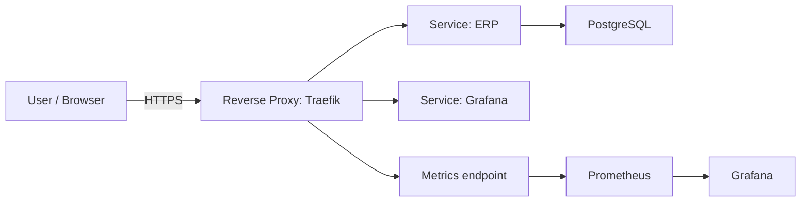

# Architecture

## Objectives

- Provide a production-like baseline on a single Ubuntu VPS
- Implement secure reverse proxy routing
- Automate TLS management
- Integrate observability from day one
- Prepare foundation for ERP backend evolution

---

## System context (C4 - Level 1)

## Containers (C4 - Level 2)

### Public entrypoints

Traefik:
- terminates TLS
- routes requests by Host() rules.
- Handles ACME challenges

Public ports:
- 80 (HTTP)
- 443 (HTTPS)

### Application Layer

- FastAPI backend
- PostgreSQL database

Database is internal-only, not publicly exposed.

### Observability Layer

- Prometheus (internal metrics scraping)
- Grafana (exposed via Traefik)
- Traefik Prometheus exporter

Metrics endpoint (:8082) is internal-only.

### Networking model

Public:
- 22 (SSH)
- 80 (HTTP)
- 443 (HTTPS)

Internal:
- 8000 (backend)
- 5432 (Postgres)
- 9090 (Prometheus)
- 8082 (Traefik metrics)

Only Traefik binds public ports.

### DNS / Hostnames

- erp.adiwoj.pl → routes to ERP entrypoint (currently whoami test service).
- grafana.adiwoj.pl → routes to Grafana UI via Traefik.
- Both subdomains have A records pointing to the VPS public IP.

### Data & persistence

- PostgreSQL → Docker volume
- ACME state → bind-mounted file
- Grafana provisioning → configuration as code

### Design Principles

- Least privilege exposure
- Edge TLS termination
- Infrastructure defined declaratively
- Incremental evolution
- Observability-first mindset

### Security baseline (current)

- SSH: root login disabled, password login disabled, key-based auth only.
- Firewall: UFW allows only 22/80/443 (plus temporary 8080 during early debugging).
- Fail2ban enabled for SSH.
- TLS handled by Let's Encrypt, auto-renewed by Traefik.

### Future extensions

- Add application stack: FastAPI + PostgreSQL + migrations.
- Add centralized logs (Loki) and dashboards provisioned “as code”.
- Add provisioning via Ansible and CI/CD deploy from GitHub Actions.
